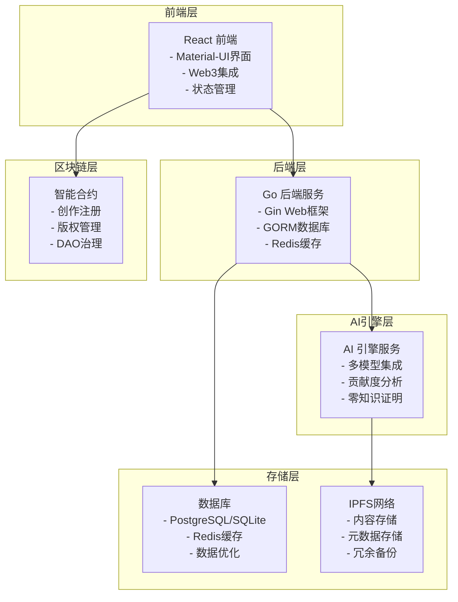

# CreatorChain - 基于区块链的数字创作确权平台

CreatorChain 是一个创新的基于区块链技术的数字创作确权平台，通过双重确权机制为所有类型的数字创作内容提供永久、可信的版权保护。项目结合了区块链的不可篡改性、AI技术的创新性和去中心化存储的可靠性，为数字内容创作行业提供了全新的解决方案。

## 🎯 项目亮点

- **多元化创作支持**：支持AI生成、人工创作、混合创作等多种创作方式
- **双重确权机制**：创作过程记录 + 最终作品确认，确保版权完整性
- **多AI模型集成**：支持OpenAI、Anthropic、Google、国产大模型等
- **零知识证明**：保护创作过程隐私的同时验证真实性
- **IPFS存储**：去中心化文件存储，确保内容永久保存
- **智能合约**：自动化确权流程，无需人工干预
- **积分激励**：基于贡献度的公平激励机制

## 🏗️ 技术架构

### 核心技术栈

- **前端**: React 18 + Material-UI + Ethers.js + Tailwind CSS
- **后端**: Go 1.24+ + Gin + GORM + Redis
- **区块链**: Solidity 0.8.20 + OpenZeppelin + Hardhat
- **存储**: IPFS + Pinata API + PostgreSQL/SQLite
- **AI**: 多模型集成 + 贡献度分析算法
- **隐私**: 零知识证明 + 加密算法（后续实现）

### 系统架构图



### 📁 项目结构

```
CreatorChain/
├─ backend/                   # Go API 后端
│  ├─ cmd/api/                # API 程序入口
│  ├─ internal/               # 业务模块
│  │  ├─ api/                 # HTTP Handler
│  │  ├─ ai/                  # AI 引擎集成
│  │  ├─ analysis/            # 贡献度与风控分析
│  │  ├─ blockchain/          # 链上交互
│  │  ├─ ipfs/                # IPFS/Pinata 集成
│  │  ├─ monitoring/          # 监控与日志
│  │  ├─ repository/          # 数据存储访问
│  │  ├─ security/            # 安全与权限
│  │  ├─ service/             # 核心业务服务
│  │  └─ zkp/                 # 零知识证明
│  └─ pkg/utils/              # 公共工具
├─ client/                    # React 前端
│  ├─ src/
│  │  ├─ components/          # UI 组件
│  │  ├─ pages/               # 页面
│  │  ├─ context/             # 全局状态
│  │  ├─ services/            # API 封装
│  │  ├─ utils/               # 工具函数
│  │  ├─ config/              # 配置
│  │  ├─ constants/           # 常量
│  │  ├─ hooks/               # 自定义 Hooks
│  │  ├─ data/                # 示例数据/文案
│  │  └─ theme/               # 主题与样式
│  └─ public/                 # 静态资源
├─ blockchain/                # Hardhat 工作区（链上注册）
│  ├─ contracts/              # CreatorChainRegistry.sol 等
│  ├─ scripts/                # 部署与辅助脚本
│  └─ artifacts/, cache/      # 编译产物
├─ contracts/                 # Hardhat 工作区（NFT/DAO）
│  ├─ contracts/              # Solidity 合约
│  │  ├─ CreatorToken.sol
│  │  ├─ CreatorNFT.sol
│  │  ├─ LicenseManager.sol
│  │  ├─ CreatorDAO.sol
│  │  └─ SimpleCreationRegistry.sol
│  ├─ scripts/                # 部署脚本（deploy-full.cjs 等）
│  ├─ test/                   # 测试
│  ├─ tools/                  # Hardhat 工具
│  └─ deployed-*.json         # 部署记录
├─ docs/                      # 文档
└─ scripts/                   # 项目级辅助脚本
```


## ✨ 核心功能

1. **多元化创作支持**：支持AI生成、人工创作、混合创作等多种创作方式
2. **双重确权机制**：创作过程记录 + 最终作品确认，确保版权完整性
3. **AI创作引擎**：集成多种AI模型，支持图像、文本、音频等多媒体生成
4. **零知识证明**：保护创作过程隐私的同时验证真实性
5. **IPFS存储**：去中心化文件存储，确保内容永久保存
6. **智能合约**：自动化确权流程，多层版权管理
7. **积分激励系统**：基于贡献度的公平激励机制
8. **DAO治理**：去中心化自治，社区投票决策

## 🚀 快速开始

### 环境要求

- **Node.js**: 18+ (前端开发)
- **Go**: 1.24+ (后端开发)
- **PostgreSQL**: 14+ 或 SQLite (数据库)
- **Redis**: 6+ (缓存层，可选)
- **IPFS**: Pinata API 或本地节点
- **区块链**: 以太坊/Polygon 测试网
- **MetaMask**: 浏览器插件

### 1. 克隆项目

```bash
git clone https://github.com/Ylim314/CreatorChain.git
cd CreatorChain
```

### 2. 配置环境变量

创建 `backend/.env` 文件：

```env
# 数据库配置
DATABASE_URL=sqlite:///creatorchain.db
# Redis配置 (可选)
REDIS_URL=redis://localhost:6379
# AI API配置
AI_API_KEY=your_api_key
AI_BASE_URL=https://api.openai.com/v1
# IPFS配置
IPFS_GATEWAY=https://ipfs.io/ipfs/
PINATA_API_KEY=your_pinata_key
PINATA_SECRET=your_pinata_secret
# 区块链配置
ETHEREUM_RPC_URL=https://mainnet.infura.io/v3/your_key
PRIVATE_KEY=your_private_key
```

### 3. 启动后端服务

```bash
cd backend
go mod download
go run cmd/api/main.go
```

后端服务将在 `http://localhost:8080` 运行。

### 4. 启动前端应用

```bash
cd client
npm install
npm start
```

前端应用将在 `http://localhost:3000` 启动。

### 5. 部署智能合约

```bash
cd contracts
npm install
npx hardhat compile
# 仅部署 SimpleCreationRegistry 供前端联调（本地确权演示）
npx hardhat run scripts/deploy-simple.js --network localhost
# 如果你使用的是本地 Ganache，可以在 hardhat.config.cjs 中配置 ganache 网络，
# 然后改用 --network ganache 进行部署
```

### 一键启动 (推荐)

```bash
# Windows - 一键启动
start_all.bat
```

## 📡 API 端点

### 用户相关

- `POST /api/v1/users/register` - 用户注册
- `POST /api/v1/users/login` - 用户登录
- `GET /api/v1/users/:address` - 获取用户信息

### 创作相关

- `POST /api/v1/creations` - 创建作品
- `GET /api/v1/public/creations` - 获取作品列表
- `GET /api/v1/public/creations/:id` - 获取作品详情
- `POST /api/v1/creations/:id/mint` - 铸造NFT

### AI相关

- `GET /api/v1/ai/models` - 获取可用AI模型
- `POST /api/v1/ai/generate` - AI内容生成
- `GET /api/v1/ai/verify/:hash` - 验证零知识证明
- `GET /api/v1/ai/ipfs/:hash` - 获取IPFS内容
- `POST /api/v1/ai/analyze` - 分析贡献度
- `POST /api/v1/ai/test-connection` - 测试API连接

### 积分相关

- `GET /api/v1/points/balance/:address` - 获取积分余额
- `POST /api/v1/points/transfer` - 转移积分
- `POST /api/v1/points/add` - 添加积分

### 市场相关

- `GET /api/v1/public/marketplace/listings` - 获取市场列表
- `POST /api/v1/marketplace/list` - 上架商品
- `POST /api/v1/marketplace/buy` - 购买商品

### 监控相关

- `GET /health` - 健康检查
- `GET /monitoring/metrics` - 性能指标
- `GET /monitoring/logs` - 日志查看

## 💰 积分系统说明

### 积分获取方式

1. **新用户注册奖励**：首次连接钱包可获得 1000 积分
2. **创作奖励**：发布原创内容可获得积分奖励
3. **互动奖励**：点赞、评论、分享可获得积分
4. **任务完成**：完成平台任务可获得积分奖励

### 积分使用场景

- **购买内容**：使用积分购买其他创作者的付费内容
- **高级功能**：解锁平台的高级创作工具和功能
- **推广服务**：使用积分推广自己的作品

### 政策合规

本平台采用积分制而非加密货币，符合相关法律法规要求，确保项目的合规性和可持续发展。

## 📚 文档中心

### 📖 技术文档

- **[项目架构文档](docs/项目架构文档.md)** - 系统架构与模块说明
- **[智能合约设计文档](docs/智能合约设计文档.md)** - 合约设计与实现细节

### 🎨 设计文档

- **[设计思路](docs/设计思路.md)** - 架构设计、技术选型、功能模块设计
- **[设计重难点](docs/设计重难点.md)** - 技术难点、业务难点、安全难点分析
- **[作品简介](docs/作品简介.md)** - 项目概述、核心功能、技术特色

### 📋 其他文档

- **[开源代码与组件使用情况说明](docs/开源代码与组件使用情况说明.md)** - 技术栈、开源组件、许可证
- **[作品版权声明](docs/作品版权声明.md)** - 版权声明和使用条款
- **[其他说明](docs/其他说明.md)** - 其他重要说明

## 🚀 创新点

- **多元化创作支持**：首个支持AI生成、人工创作、混合创作的全方位版权保护平台
- **双重确权机制**：创新的两次确权流程，确保版权完整性
- **AI创作版权保护**：专门针对AI生成内容的版权保护机制
- **零知识证明应用**：在保护隐私的同时验证创作真实性
- **多层版权管理**：细粒度的版权控制和收益分配
- **积分制激励**：合规的激励机制，促进创作生态发展

## 🤝 贡献指南

1. Fork 项目
2. 创建特性分支 (`git checkout -b feature/AmazingFeature`)
3. 提交更改 (`git commit -m 'Add some AmazingFeature'`)
4. 推送到分支 (`git push origin feature/AmazingFeature`)
5. 打开 Pull Request

详细流程与校验命令见 [CONTRIBUTING.md](CONTRIBUTING.md)。

## 📄 许可证

本项目采用 MIT 许可证。

## 🙏 致谢

- [OpenZeppelin](https://openzeppelin.com/) - 智能合约安全库
- [Gin](https://gin-gonic.com/) - Go Web框架
- [Material-UI](https://mui.com/) - React UI组件库
- [IPFS](https://ipfs.io/) - 去中心化存储协议

**CreatorChain** - 让AI创作真正属于创作者 🎨✨
