# CreatorChain - 基于区块链的数字创作确权平台

CreatorChain 是一个创新的基于区块链技术的数字创作确权平台，通过双重确权机制为所有类型的数字创作内容提供永久、可信的版权保护。项目结合了区块链的不可篡改性、AI技术的创新性和去中心化存储的可靠性，为数字内容创作行业提供了全新的解决方案。

## 🎯 项目亮点

- **多元化创作支持**：支持AI生成、人工创作、混合创作等多种创作方式
- **双重确权机制**：创作过程记录 + 最终作品确认，确保版权完整性
- **多AI模型集成**：智谱GLM-4.6/GLM-4-Air、OpenAI (GPT-4/GPT-3.5)，支持Mock测试模式
- **加密承诺方案**：基于Schnorr签名的commitment scheme，保护创作隐私并验证真实性
- **签名认证机制**：基于以太坊签名的无密码认证，防重放攻击，支持多账户切换
- **IPFS存储**：去中心化文件存储，确保内容永久保存
- **智能合约**：自动化确权流程，无需人工干预
- **积分激励**：基于贡献度的公平激励机制
- **完善的安全特性**：CORS白名单、请求超时、输入校验、时间戳验证等多层防护

## 🏗️ 技术架构

### 核心技术栈

- **前端**: React 18 + Material-UI + Ethers.js + Tailwind CSS
- **后端**: Go 1.21+ + Gin + GORM + Redis
- **区块链**: Solidity 0.8.20 + OpenZeppelin + Hardhat
- **存储**: IPFS + Pinata API + PostgreSQL/SQLite
- **AI**: 智谱GLM-4.6/GLM-4-Air + OpenAI (GPT-4/GPT-3.5) + Mock模式 + 贡献度分析
- **隐私**: Schnorr签名 + 加密承诺方案(Commitment Scheme) + 时间戳验证

### 系统架构图

```mermaid
graph TB
      subgraph Frontend[前端层]
          A["React 前端<br/>Material-UI 界面<br/>Web3 集成<br/>状态管理"]
      end

      subgraph Backend[后端层]
          B["Go 后端服务<br/>Gin Web 框架<br/>GORM 数据库<br/>Redis 缓存"]
      end

      subgraph AIEngine[AI 引擎层]
          C["AI 引擎服务<br/>智谱 GLM-4.6 / GLM-4-Air<br/>OpenAI GPT-4 /
  GPT-3.5<br/>Mock 测试模式<br/>贡献度分析"]
      end

      subgraph Chain[区块链层]
          D["智能合约<br/>创作注册<br/>版权管理<br/>DAO 治理"]
      end

      subgraph Storage[存储层]
          E["数据库<br/>PostgreSQL / SQLite<br/>Redis 缓存<br/>数据优化"]
          F["IPFS 网络<br/>内容存储<br/>元数据存储<br/>冗余备份"]
      end

      A --> B
      B --> C
      A --> D
      B --> E
      C --> F
```



### 技术栈

- **前端**: React 18 + Material-UI + Ethers.js + Tailwind CSS
- **后端**: Go 1.21+ + Gin + GORM + Redis
- **AI引擎**: 智谱GLM-4.6/GLM-4-Air + OpenAI + Mock模式 + 贡献度分析
- **区块链**: Solidity 0.8.20 + OpenZeppelin + Hardhat
- **存储**: IPFS + Pinata API + PostgreSQL/SQLite
- **隐私**: Schnorr签名 + 加密承诺方案(Commitment Scheme) + 时间戳验证

## 📁 项目结构

```
CreatorChain/
├── backend/                 # 后端服务
│   ├── cmd/api/            # API服务入口
│   ├── internal/           # 内部包
│   │   ├── api/           # API处理器
│   │   ├── ai/            # AI引擎
│   │   ├── blockchain/    # 区块链客户端
│   │   ├── ipfs/         # IPFS客户端
│   │   ├── repository/   # 数据访问层
│   │   ├── service/     # 业务逻辑层
│   │   ├── zkp/         # 加密承诺方案(Commitment Scheme)
│   │   └── monitoring/  # 监控系统
│   └── pkg/utils/        # 工具包
├── client/                # 前端应用
│   ├── src/
│   │   ├── components/   # 组件
│   │   ├── pages/       # 页面
│   │   ├── context/     # 上下文
│   │   ├── services/    # 服务
│   │   └── utils/       # 工具
│   └── public/          # 静态资源
├── contracts/            # Hardhat 智能合约工程
│   ├── contracts/        # Solidity 源码
│   │   ├── CreatorToken.sol          # 设计原型（不实际部署）
│   │   ├── CreatorNFT.sol            # 版权 NFT（双重确权）
│   │   ├── LicenseManager.sol        # 设计原型（不实际部署）
│   │   ├── CreatorDAO.sol            # 设计原型（不实际部署）
│   │   └── SimpleCreationRegistry.sol# 双重确权最小实现
│   ├── scripts/          # 部署脚本（deploy-full.cjs、deploy-simple.js等）
│   ├── test/             # 合约测试
│   └── deployed-*.json   # 最新部署记录
└── docs/                # 文档
```

## 🧱 智能合约模块

- **CreatorToken.sol**：设计原型合约，不实际部署。本项目采用链下积分系统，不涉及任何虚拟货币。
- **CreatorNFT.sol**：基于 ERC-721 的版权凭证，负责铸造与元数据管理，连接前端创作流程。仅作为版权证明，不涉及交易。
- **LicenseManager.sol**：设计原型合约，不实际部署。实际授权功能通过后端API实现，使用链下积分系统。
- **CreatorDAO.sol**：设计原型合约，不实际部署。实际治理功能通过后端API实现，使用链下积分系统。
- **SimpleCreationRegistry.sol**：面向当前前端的轻量确权流程，提供创作登记、确认、查询与角色管理，便于快速联调。

## ✨ 核心功能

1. **多元化创作支持**：支持AI生成、人工创作、混合创作等多种创作方式
2. **双重确权机制**：创作过程记录 + 最终作品确认，确保版权完整性
3. **AI创作引擎**：集成智谱GLM、OpenAI等多种AI模型，支持图像、文本、音频等多媒体生成
4. **加密承诺方案**：基于Schnorr签名的commitment scheme，保护创作过程隐私的同时验证真实性
5. **IPFS存储**：去中心化文件存储，确保内容永久保存
6. **智能合约**：自动化确权流程，多层版权管理
7. **积分激励系统**：基于贡献度的公平激励机制
8. **DAO治理**：去中心化自治，社区投票决策

## 🚀 快速开始

### 环境要求

- **Node.js**: 18+ (前端开发)
- **Go**: 1.21+ (后端开发)
- **PostgreSQL**: 14+ 或 SQLite (数据库)
- **Redis**: 6+ (缓存层，可选)
- **IPFS**: Pinata API 或本地节点
- **区块链**: 以太坊/Polygon 测试网
- **MetaMask**: 浏览器插件

### 1. 克隆项目

```bash
git clone https://github.com/your-username/CreatorChain.git
cd CreatorChain
```

### 2. 配置环境变量

创建 `backend/.env` 文件：

```env
# 数据库配置
DATABASE_URL=sqlite:///creatorchain.db
# Redis配置 (可选)
REDIS_URL=redis://localhost:6379
# AI API配置
AI_API_KEY=your_api_key
AI_BASE_URL=https://api.openai.com/v1
# IPFS配置
IPFS_GATEWAY=https://ipfs.io/ipfs/
PINATA_API_KEY=your_pinata_key
PINATA_SECRET=your_pinata_secret
# 区块链配置
ETHEREUM_RPC_URL=https://mainnet.infura.io/v3/your_key
PRIVATE_KEY=your_private_key
```

### 3. 启动后端服务

```bash
cd backend
go mod download
go run cmd/api/main.go
```

后端服务将在 `http://localhost:8080` 运行。

### 4. 启动前端应用

```bash
cd client
npm install
npm start
```

前端应用将在 `http://localhost:3000` 启动。

### 5. 部署智能合约

```bash
cd contracts
npm install
npx hardhat compile
# 仅部署 SimpleCreationRegistry 供前端联调（版权确权NFT）
npx hardhat run scripts/deploy-simple.js --network localhost
# 注意：CreatorToken、LicenseManager、CreatorDAO 为设计原型，不实际部署
```

部署成功后，新的合约地址会写入 `contracts/deployed-contracts.json`，可直接拷贝到前端配置。

### 一键启动 (推荐)

```bash
# Windows - 一键启动
启动项目.bat
```

## 🔐 认证与安全机制

### 基于签名的认证

CreatorChain 采用基于以太坊签名的无密码认证机制，无需传统的用户名密码登录：

#### 登录流程

1. **连接钱包**：用户通过MetaMask连接钱包
2. **签名消息**：前端生成签名消息 `CreatorChain Authentication [userAddress] [timestamp]`
3. **用户签名**：用户使用MetaMask对消息进行签名
4. **验证签名**：后端验证签名的有效性和时间戳（±5分钟有效期）
5. **颁发令牌**：验证通过后，后端颁发JWT令牌用于后续请求

#### 请求认证

所有受保护的API请求需要包含以下HTTP头：

- `User-Address`: 用户钱包地址
- `Signature`: MetaMask签名
- `Message`: 签名的原始消息
- `Timestamp`: 时间戳
- `Authorization`: Bearer JWT令牌（登录后）

### 安全特性

- **重放攻击防护**：时间戳验证 + 已使用签名追踪
- **CORS白名单**：仅允许配置的前端域名访问
- **请求超时**：全局请求超时保护（可配置）
- **签名验证**：基于以太坊椭圆曲线数字签名算法(ECDSA)
- **时间窗口限制**：签名5分钟内有效

## 📡 API 端点

**注意**：标注为 🔒 的端点需要认证（需要包含签名验证的HTTP头）。标注为 🌐 的端点为公开端点。

### 用户相关

- 🔒 `POST /api/v1/users/register` - 用户注册（基于签名）
- 🔒 `POST /api/v1/users/login` - 用户登录（基于签名）
- 🔒 `GET /api/v1/users/:address` - 获取用户信息

### 创作相关

- 🔒 `POST /api/v1/creations` - 创建作品
- 🌐 `GET /api/v1/public/creations` - 获取作品列表
- 🌐 `GET /api/v1/public/creations/:id` - 获取作品详情
- 🔒 `POST /api/v1/creations/:id/mint` - 铸造NFT

### AI相关

- 🌐 `GET /api/v1/ai/models` - 获取可用AI模型列表
- 🔒 `POST /api/v1/ai/generate` - AI内容生成
- 🌐 `GET /api/v1/ai/verify/:hash` - 验证加密承诺(Commitment)
- 🌐 `GET /api/v1/ai/ipfs/:hash` - 获取IPFS内容
- 🔒 `POST /api/v1/ai/analyze` - 分析贡献度
- 🔒 `POST /api/v1/ai/test-connection` - 测试AI API连接

### 积分相关

- 🔒 `GET /api/v1/points/balance/:address` - 获取积分余额
- 🔒 `POST /api/v1/points/transfer` - 转移积分
- 🔒 `POST /api/v1/points/add` - 添加积分

### 市场相关

- 🌐 `GET /api/v1/public/marketplace/listings` - 获取市场列表
- 🔒 `POST /api/v1/marketplace/list` - 上架商品
- 🔒 `POST /api/v1/marketplace/buy` - 购买商品

### 监控相关

- 🌐 `GET /health` - 健康检查
- 🌐 `GET /monitoring/metrics` - 性能指标
- 🌐 `GET /monitoring/logs` - 日志查看

## 💰 积分系统说明

### 积分获取方式

1. **新用户注册奖励**：首次连接钱包可获得 1000 积分
2. **创作奖励**：发布原创内容可获得积分奖励
3. **互动奖励**：点赞、评论、分享可获得积分
4. **任务完成**：完成平台任务可获得积分奖励

### 积分使用场景

- **购买内容**：使用积分购买其他创作者的付费内容
- **高级功能**：解锁平台的高级创作工具和功能
- **推广服务**：使用积分推广自己的作品

### 政策合规

本平台采用积分制而非加密货币，符合相关法律法规要求，确保项目的合规性和可持续发展。

## 📚 文档中心

### 🎯 核心文档

- **[项目架构文档](项目架构文档.md)** - 系统分层、模块依赖与部署拓扑
- **[智能合约设计文档](智能合约设计文档.md)** - 合约模块、权限模型与交互流程
- **[作品安装说明](作品安装说明.md)** - 从环境准备到一键启动的操作指南

### 📖 技术与设计

- **[设计思路](设计思路.md)** - 技术选型、双重确权链路与AI协同方案
- **[设计重难点](设计重难点.md)** - 架构瓶颈、性能、安全与隐私要点
- **[项目解析与PPT制作指南](项目解析与PPT制作指南.md)** - 讲解要点、演示脚本、PPT 素材
- **[其他说明](其他说明.md)** - 额外的评审注意事项与补充说明

### 🔧 实战材料

- **[作品安装说明](作品安装说明.md)** - 详尽的部署、测试和常见问题
- **README.md（本文）** - 整体概览、快速上手与文档索引

## 🚀 创新点

- **多元化创作支持**：首个支持AI生成、人工创作、混合创作的全方位版权保护平台
- **双重确权机制**：创新的两次确权流程，确保版权完整性
- **AI创作版权保护**：专门针对AI生成内容的版权保护机制
- **加密承诺方案**：基于Schnorr签名的commitment scheme，在保护隐私的同时验证创作真实性
- **签名认证机制**：基于以太坊签名的无密码认证，增强安全性并防止重放攻击
- **多层版权管理**：细粒度的版权控制和收益分配
- **积分制激励**：合规的激励机制，促进创作生态发展

## 🤝 贡献指南

1. Fork 项目
2. 创建特性分支 (`git checkout -b feature/AmazingFeature`)
3. 提交更改 (`git commit -m 'Add some AmazingFeature'`)
4. 推送到分支 (`git push origin feature/AmazingFeature`)
5. 打开 Pull Request

## 📄 许可证

本项目采用 MIT 许可证 - 查看 [LICENSE](LICENSE) 文件了解详情。

## 🙏 致谢

- [OpenZeppelin](https://openzeppelin.com/) - 智能合约安全库
- [Gin](https://gin-gonic.com/) - Go Web框架
- [Material-UI](https://mui.com/) - React UI组件库
- [IPFS](https://ipfs.io/) - 去中心化存储协议

**CreatorChain** - 让AI创作真正属于创作者 🎨✨
