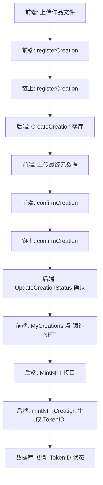

# CreatorChain 课程设计答辩讲稿（区块链与确权流程）

> 这个文档是给你答辩时用的讲稿草案，你可以按章节删减、调整节奏。  
> 建议配合 VS Code 打开相关文件边讲边指。

---

## 一、开场与项目定位（约 30 秒）

各位老师好，我这部分主要汇报 CreatorChain 项目在「区块链确权」这一块的设计和实现。

CreatorChain 的目标，是给数字作品提供一套**双重确权**机制：  
既能证明“我从什么时候开始创作这份内容”，又能在创作完成后锁定“最终版本”的哈希。

在整个系统里，这一块主要落在 `contracts/` 目录下的 Solidity 合约，以及前端、后端和它们之间的调用流程。

---

## 二、合约总体结构总览（约 1 分钟）

项目中一共有 5 份主要合约文件，路径在 `contracts/contracts`：

- `SimpleCreationRegistry.sol`  
  当前前端本地演示直接联调的**主合约**，实现了创作的双重确权（第一次登记 + 第二次确认）。

- `CreatorNFT.sol`  
  在确权结果之上，设计了一套完整的版权 NFT 合约（ERC‑721 + 版税 + 状态机），说明未来如果要真的发 NFT，可以怎么扩展。

- `LicenseManager.sol`（设计原型）  
  主要负责版权授权管理，比如个人授权、商业授权、独家授权、开源授权等，还没有完全打通到前端。

- `CreatorDAO.sol`（设计原型）  
  DAO 治理合约，用于未来做参数、费用、升级等提案与投票，目前作为治理层草案。

- `CreatorToken.sol`（设计原型）  
  平台代币/积分的链上版本构想，当前实际积分是由后端数据库实现，这个合约作为未来可以迁到链上的蓝本。

答辩中我会重点讲第一份 `SimpleCreationRegistry`，简单介绍 `CreatorNFT`，剩下三份用 1–2 句话讲清设计思路即可。

---

## 三、核心合约：SimpleCreationRegistry（约 2–3 分钟）

> 文件：`contracts/contracts/SimpleCreationRegistry.sol`

### 1. 设计目标

SimpleCreationRegistry 的设计目标只有一件事：  
**用尽量简单的结构，在链上记录一份作品「创作过程」和「最终版本」的两次确权。**

它不直接负责 NFT、交易，只负责确权——也就是“谁在什么时候创作了什么内容”。

### 2. 链上数据结构

核心结构体是 `Creation`：

- `id`：作品在本合约内部的自增 ID（1、2、3……）。
- `creator`：创作者的钱包地址，即发起交易的 `msg.sender`。
- `title` / `description`：作品标题和描述，由前端传入。
- `ipfsHash`：作品文件或元数据在 IPFS/本地上传服务中的哈希或路径。
- `creationType`：作品类型，比如 0=图像，1=文本，2=音频等，与前端约定。
- `contentHash`：把标题、描述、文件哈希、创作者地址等做 `keccak256` 得到的内容摘要哈希，用于防篡改。
- `confirmed`：布尔值，标记这条作品是否已经完成第二次确权。
- `timestamp`：第一次登记时的区块时间戳，作为时间先后的证据。

合约还维护了两个映射：

- `creations[id]`：通过作品 ID 查询完整的 `Creation`；
- `creatorToCreations[address]`：一个创作者名下的所有作品 ID。

### 3. 第一次确权：registerCreation

函数：`registerCreation(string _title, string _description, string _ipfsHash, uint256 _creationType, bytes32 _contentHash)`

主要做三件事：

1. **分配 ID**：  
   自增 `_creationCounter`，得到新的 `creationId`。
2. **写入结构体**：  
   把调用者地址、标题、描述、IPFS 哈希、作品类型、内容哈希、时间戳都写入 `creations[creationId]`，并把 `creationId` 记到 `creatorToCreations[msg.sender]`。
3. **触发事件**：  
   触发 `CreationRegistered(creationId, msg.sender, _title, _ipfsHash)`，方便前端或区块浏览器索引。

在前端流程中：

- 手工创作页面 `ManualCreation.handleSubmit` 会先用 `uploadToIPFS` 上传作品文件；
- 然后调用 `blockchainService.registerCreation(processMetadata)`；
- 这一笔交易就是“第一次确权”，证明**我从这个时间点开始，就掌握了某份内容的摘要哈希**。

### 4. 第二次确权：confirmCreation

函数：`confirmCreation(uint256 _creationId, string _finalIpfsHash, bytes32 _finalContentHash)`

逻辑要点：

- 安全限制：
  ```solidity
  require(creations[_creationId].creator == msg.sender, "Not the creator");
  ```
  只有第一次登记这条作品的创作者本人，才有权进行最终确认。

- 状态更新：
  - 把 `ipfsHash` 更新为最终元数据的哈希；
  - 把 `contentHash` 更新为最终内容哈希；
  - 把 `confirmed` 标记为 `true`；
  - 触发 `CreationConfirmed` 事件。

在前端流程里：

- 前端会组装一个更完整的 `finalMetadata`（包含 creationId、登记交易哈希等），再上传到 IPFS；
+- 然后调用 `blockchainService.confirmCreation(...)`；
+- 这一步相当于在链上“盖章”：**这就是我最终确认的版本，后续大家用这份哈希来验证。**

### 5. 为什么要“两次确权”

在答辩时可以这样总结：

> 如果只在最后上传一次最终文件的哈希，很容易被别人抢先登记；  
> 我们把确权拆成两步：
>
> - 第一次确权：尽早把创作过程的摘要哈希和时间戳写入链上，证明“我什么时候开始创作/掌握这份内容”；  
> - 第二次确权：在作品完成后，把最终作品和完整元数据的哈希再确认一次，锁定“最终版本”。  
>
> 这样既能证明时间顺序和原创性，又给创作过程和 AI 分析留下修改空间，不需要在第一天就把所有信息一次性写死。

---

## 四、确权全流程简图（Mermaid 语法，简化版）

> 可以直接放到 PPT 或 Markdown 里渲染；如果不支持 Mermaid，也可以直接展示这张图作为讲解参考。



讲解顺序建议：

1. A → B → C：第一次确权，把过程哈希登记到 `SimpleCreationRegistry`。  
2. C → D：同时在后端落一条作品记录，方便列表、搜索和本地展示。  
3. D → E → F → G：作品完成后，上传最终元数据并做第二次确权。  
4. G → H：后端根据链上结果更新作品状态为 confirmed。  
5. H → I → J → K → L：在“我的创作”页面点击“铸造 NFT”，当前版本由后端模拟生成 TokenID 并存入数据库，为将来接入真正的 `CreatorNFT` 合约预留接口。

---

## 五、扩展合约：CreatorNFT（约 1–2 分钟）

> 文件：`contracts/contracts/CreatorNFT.sol`

可以作为“进阶设计”介绍，不必逐行解释代码。

### 1. 状态机设计

合约中有一个 `enum CreationStage`，定义了作品在链上的生命周期：

- `ProcessRecorded`：创作过程已记录（对应第一次确权）；  
- `FinalConfirmed`：最终作品已确认（对应第二次确权）；  
- `NFTMinted`：NFT 已铸造；  
- `Listed`：已上架市场；  
- `Transferred`：已发生转移。

这提供了一个比 SimpleCreationRegistry 更完整的状态机，用来追踪作品从创作到流通的全过程。

### 2. CreationInfo 结构体

`CreatorNFT` 使用 `CreationInfo` 结构体记录更丰富的信息，包括：

- tokenId、originalCreator、currentOwner；  
- 过程 IPFS 哈希、内容哈希、时间戳；  
- 最终 IPFS 哈希、内容哈希、确认时间；  
- 标题、描述、创作类型、贡献度评分；  
- 当前阶段和转移次数。

可以把它理解为：**在 SimpleCreationRegistry 的确权信息之上，再加了一层 NFT 与版税的能力。**

### 3. 三步流程函数

- `recordCreationProcess(...)` → 对应第一次确权，记录创作过程；  
- `confirmFinalCreation(...)` → 对应第二次确权，确认最终作品；  
- `mintCreationNFT(...)` → 在完成确权后真正铸造 ERC‑721 NFT，并设置默认版税。

在当前版本中，前端主要使用的是 `SimpleCreationRegistry`，`CreatorNFT` 用来展示未来如何把确权结果和 NFT、版税、市场交易结合起来。

---

## 六、其他三个合约的简要说明（每个 1–2 句话）

> 文件路径都在 `contracts/contracts`。

1. **LicenseManager.sol**  
   - 设计用于管理作品/NFT 的授权合同：个人授权、商业授权、独家授权、开源授权等；  
   - 记录授权类型、价格、有效期、地域范围、使用次数、是否可转授权、分成比例等字段，当前主要作为数据结构原型，尚未完全接入前端。

2. **CreatorDAO.sol**  
   - DAO 治理合约原型，提供提案、投票和执行状态结构；  
   - 设计目标是让创作者社区对参数、费用、合约升级等进行治理，目前作为治理层草案保留。

3. **CreatorToken.sol**  
   - 平台代币/积分的链上版本构想；  
   - 实际运行时项目采用链下积分系统（积分存数据库），这个合约作为未来可能迁到链上的参考设计。

---

## 七、总结发言示例（约 20–30 秒）

最后可以用下面这段话来收尾：

> 总结一下，我们在合约层做了一个分层设计：  
> - `SimpleCreationRegistry` 实现了最小可用的双重确权，目前前端本地演示就是直接连这份合约；  
> - `CreatorNFT` 展示了在确权结果之上如何进一步铸造 NFT、增加版税和生命周期管理；  
> - `LicenseManager`、`CreatorDAO`、`CreatorToken` 这三个合约，则分别对应版权授权、社区治理和代币经济，是我们为后续扩展预留的设计。  
> 通过这种方式，我们既保证当前演示流程足够简单可用，又把未来的扩展方向在合约层提前规划好了。

老师如果需要，我可以现场从前端的“上传作品”按钮，一路点到链上 `SimpleCreationRegistry` 的事件日志，演示完整的双重确权流程。

