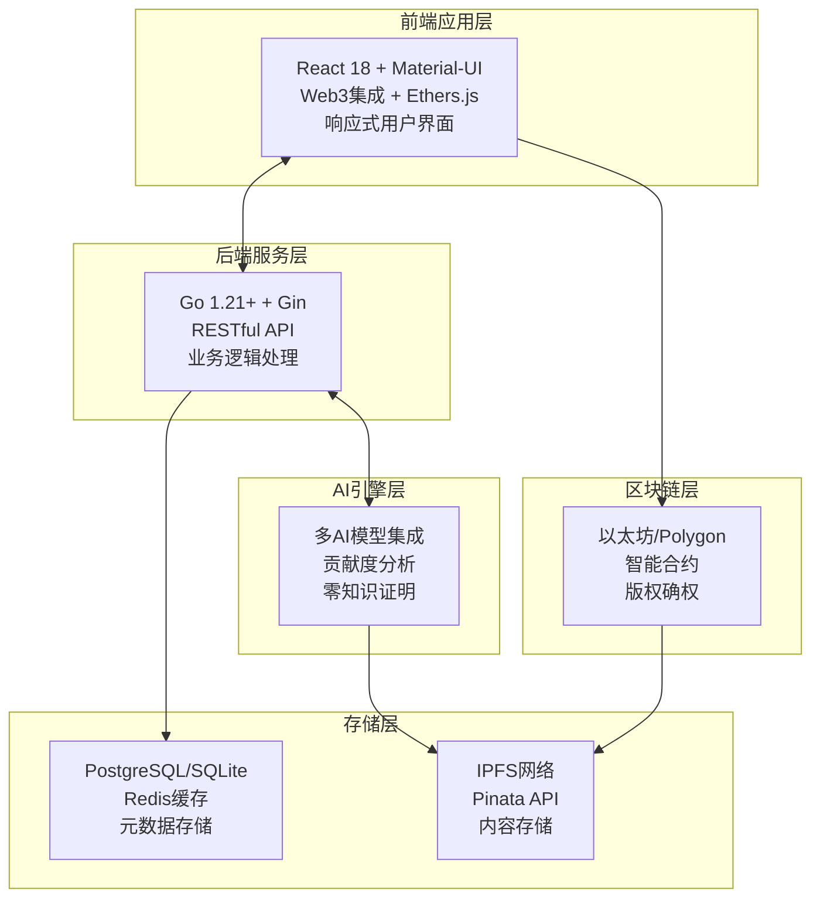
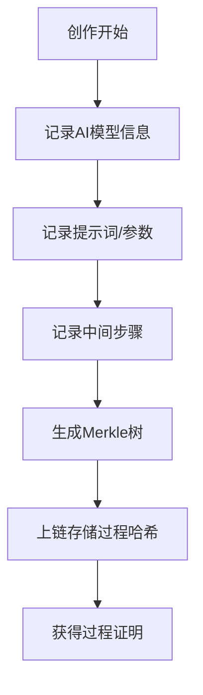
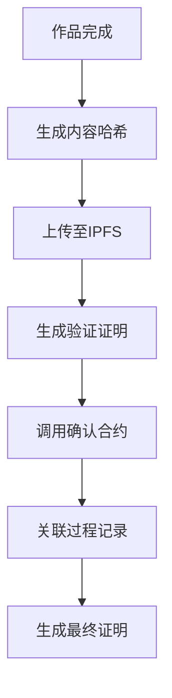

# CreatorChain 设计思路

## 问题分析

在数字化创作时代，创作者面临着以下核心问题：

1. **版权归属不明确**：数字作品容易被复制和盗用，版权归属难以确定
2. **创作过程难以验证**：传统版权保护无法验证创作的真实过程
3. **收益分配不公平**：中间商抽取大量佣金，创作者收益微薄
4. **AI创作确权困难**：AI生成内容的版权保护存在法律和技术空白
5. **存储安全隐患**：集中式存储存在数据丢失和篡改风险

## 解决方案

CreatorChain 通过创新的双重确权机制和区块链技术，构建全方位的数字创作确权平台：

- **双重确权机制**：创作过程记录 + 最终作品确认，确保版权完整性
- **区块链不可篡改性**：利用区块链技术保证版权信息永久可信
- **多元化创作支持**：支持AI生成、人工创作、混合创作等所有创作方式
- **去中心化存储**：使用IPFS确保内容永久保存
- **智能合约自动化**：通过智能合约实现自动化确权和收益分配
- **积分激励系统**：建立合规的创作激励机制

## 整体架构设计

### 系统架构图

### 核心设计原则

#### 1. 双重确权原则
- **过程确权**：记录创作过程的关键信息和步骤
- **结果确权**：确认最终作品的完整性和原创性
- **链上验证**：所有确权信息通过区块链永久记录

#### 2. 多元化支持原则
- **AI创作支持**：专门为AI生成内容设计的确权机制
- **传统创作支持**：为人工创作提供完整的版权保护
- **混合创作支持**：支持AI辅助的人工创作确权

#### 3. 去中心化原则
- **数据去中心化**：版权信息存储在区块链上
- **存储去中心化**：使用IPFS分布式存储内容
- **治理去中心化**：社区参与平台治理决策

#### 4. 隐私保护原则
- **零知识证明**：验证创作真实性的同时保护隐私
- **分层隐私**：不同层次的隐私保护机制
- **用户控制**：用户完全控制自己的隐私设置

#### 5. 安全性原则
- **智能合约安全**：使用OpenZeppelin安全库
- **多层防护**：前端、后端、区块链的全方位安全防护
- **数据加密**：敏感数据的多重加密保护

## 技术选型理由

### 前端技术选型：React 18 + Material-UI + Ethers.js
- **React 18**：最新版本提供并发特性，提升用户体验
- **Material-UI**：成熟的组件库，快速构建专业界面
- **Ethers.js**：最佳的Web3集成库，支持多种钱包

### 后端技术选型：Go 1.21+ + Gin + GORM
- **Go语言优势**：高性能、强类型、并发支持优秀
- **Gin框架**：轻量级、高性能的Web框架
- **GORM**：功能强大的ORM，支持自动迁移

### 区块链技术选型：Solidity 0.8.20 + OpenZeppelin + Hardhat
- **Solidity 0.8.20**：最新版本，内置溢出保护
- **OpenZeppelin**：经过安全审计的合约库
- **Hardhat**：现代化的开发工具链

### AI技术选型：多模型集成策略
- **OpenAI系列**：GPT-4、DALL-E 3等
- **开源模型**：Stable Diffusion、Llama等
- **国产大模型**：通义千问、文心一言等

## 核心功能设计

### 1. 双重确权机制

#### 创作过程记录（第一次确权）

#### 最终作品确认（第二次确权）

### 2. 多AI模型集成

#### AI引擎架构
- **统一接口**：为不同AI模型提供统一的调用接口
- **智能路由**：根据创作需求自动选择最适合的AI模型
- **成本优化**：根据任务复杂度选择性价比最高的模型

#### 贡献度分析算法
- **多维度评分**：提示词复杂度、参数优化、迭代次数、模型难度、原创性
- **权重分配**：提示词30%、参数优化25%、迭代次数20%、模型难度15%、原创性10%
- **防刷机制**：使用对数函数防止无限增长

### 3. 零知识证明系统

#### Schnorr零知识证明
- **隐私保护**：验证创作真实性的同时保护创作过程隐私
- **高效验证**：基于椭圆曲线的快速验证算法
- **标准化**：采用业界标准的零知识证明协议

### 4. IPFS分布式存储

#### 存储策略
- **多重备份**：本地IPFS节点 + Pinata企业级服务
- **内容寻址**：基于内容哈希的永久链接
- **冗余保障**：分布式存储确保内容永久保存

### 5. 积分激励系统

#### 积分经济模型
- **合规设计**：使用积分制度，符合相关法律法规
- **公平激励**：基于贡献度的科学评分算法
- **零手续费**：避免传统区块链交易的高昂Gas费用

## 数据模型设计

### 核心实体关系

#### 用户实体
- **基础信息**：地址、用户名、邮箱、头像、简介
- **积分系统**：积分余额、等级、角色
- **关联关系**：创作、收藏、交易

#### 创作实体
- **内容信息**：标题、描述、内容哈希、IPFS哈希
- **确权信息**：创作过程哈希、验证证明、中间步骤
- **AI信息**：AI模型、提示词、参数、贡献度评分
- **商业信息**：价格、状态、可见性、销售状态

#### 交易实体
- **交易信息**：交易哈希、类型、金额、货币
- **状态跟踪**：状态、区块号、Gas使用量
- **关联信息**：用户、创作、元数据

## 安全设计

### 1. 智能合约安全
- **防重入攻击**：使用OpenZeppelin的ReentrancyGuard
- **权限控制**：基于角色的访问控制（RBAC）
- **输入验证**：严格的参数验证和边界检查

### 2. 后端安全
- **请求验证**：签名验证、时间戳防重放
- **输入清理**：HTML转义、SQL注入防护
- **访问控制**：JWT令牌、API限流

### 3. 前端安全
- **Web3安全**：钱包连接验证、网络检查
- **XSS防护**：内容安全策略、输入验证
- **CSRF防护**：同源策略、令牌验证

## 性能优化设计

### 1. 前端性能优化
- **代码分割**：按需加载，减少初始包大小
- **组件缓存**：React.memo、useMemo优化渲染
- **资源优化**：图片懒加载、CDN加速

### 2. 后端性能优化
- **数据库优化**：连接池、索引优化、查询优化
- **缓存策略**：Redis缓存、多级缓存
- **并发处理**：Go协程、异步处理

### 3. 区块链优化
- **Gas优化**：打包结构、批量操作、事件存储
- **网络选择**：根据需求选择最适合的区块链网络
- **合约优化**：减少存储操作、优化计算逻辑

## 扩展性设计

### 1. 微服务架构
- **服务拆分**：用户服务、创作服务、交易服务、治理服务
- **API网关**：统一入口、负载均衡、限流熔断
- **服务发现**：动态服务注册与发现

### 2. 数据库扩展
- **分库分表**：按用户ID、创作ID、时间分片
- **读写分离**：主从复制、读写分离
- **缓存优化**：多级缓存、缓存预热

### 3. 跨链扩展
- **多链适配**：支持以太坊、Polygon、BSC等
- **跨链桥接**：资产跨链、数据同步
- **统一接口**：跨链操作的统一API

## 监控与运维

### 1. 系统监控
- **指标收集**：Prometheus指标、Grafana可视化
- **健康检查**：数据库、Redis、IPFS、区块链连接检查
- **告警机制**：异常检测、自动告警

### 2. 日志管理
- **结构化日志**：JSON格式、统一字段
- **日志聚合**：ELK Stack、日志分析
- **审计追踪**：操作记录、安全审计

## 总结

CreatorChain的设计思路体现了以下核心理念：

### 1. 技术创新
- **双重确权机制**：创新的两步确权流程，确保版权完整性
- **多元化创作支持**：首个支持所有创作方式的版权保护平台
- **零知识证明应用**：在保护隐私的同时验证创作真实性
- **AI+区块链深度融合**：技术栈的有机结合

### 2. 用户中心
- **简化用户体验**：隐藏复杂的技术细节，提供直观的操作界面
- **多样化需求满足**：支持不同类型创作者的差异化需求
- **合规激励机制**：积分制度符合法律法规要求

### 3. 安全可靠
- **多层安全防护**：前端、后端、区块链的全方位安全保护
- **企业级标准**：采用业界最佳实践和安全标准
- **隐私保护优先**：零知识证明和数据加密保护用户隐私

### 4. 高性能扩展
- **微服务架构**：支持水平扩展和模块化部署
- **多级缓存**：优化系统响应速度和用户体验
- **跨链兼容**：支持多区块链网络的互操作性

### 5. 开放生态
- **标准化接口**：提供完整的API接口支持第三方集成
- **插件化设计**：支持功能扩展和定制化开发
- **社区治理**：建设开放透明的社区治理机制

通过系统性的架构设计和创新性的功能实现，CreatorChain为数字创作领域提供了一个完整、可靠、可扩展的版权保护解决方案，具有重要的技术价值和社会意义。