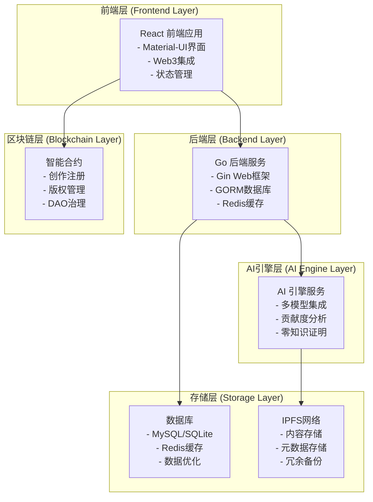

# CreatorChain 项目架构文档

## 🏗️ 整体架构

### 系统架构图

```mermaid
graph TB
    subgraph "前端层 (Frontend Layer)"
        A[React 前端应用<br/>- Material-UI界面<br/>- Web3集成<br/>- 状态管理]
    end
  
    subgraph "后端层 (Backend Layer)"
        B[Go 后端服务<br/>- Gin Web框架<br/>- GORM数据库<br/>- Redis缓存]
    end
  
    subgraph "AI引擎层 (AI Engine Layer)"
        C[AI 引擎服务<br/>- 多模型集成<br/>- 贡献度分析<br/>- 零知识证明]
    end
  
    subgraph "区块链层 (Blockchain Layer)"
        D[智能合约<br/>- 创作注册<br/>- 版权管理<br/>- DAO治理]
    end
  
    subgraph "存储层 (Storage Layer)"
        E[数据库<br/>- MySQL/SQLite<br/>- Redis缓存<br/>- 数据优化]
        F[IPFS网络<br/>- 内容存储<br/>- 元数据存储<br/>- 冗余备份]
    end
  
    A --> B
    B --> C
    A --> D
    B --> E
    C --> F
```
